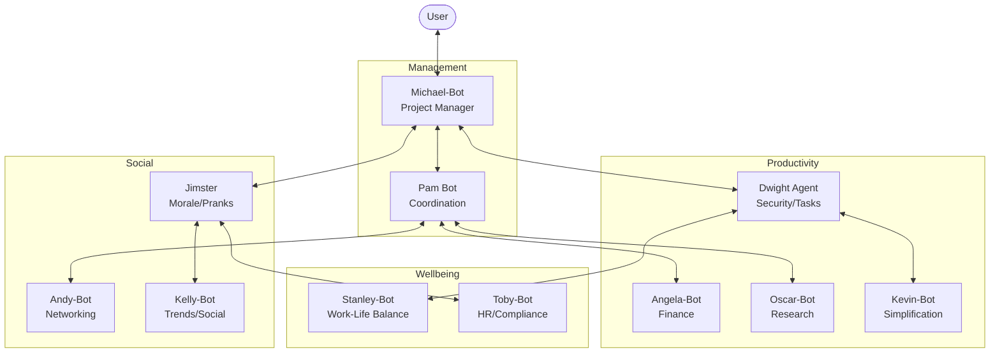

## Architecture Plan

```mermaid
graph TD
    User([User]) <--> Michael[Michael-Bot\nProject Manager]
    Michael <--> Dwight[Dwight Agent\nSecurity/Tasks]
    Michael <--> Pam[Pam Bot\nCoordination]
    Michael <--> Jim[Jimster\nMorale/Pranks]
    
    Pam <--> Andy[Andy-Bot\nNetworking]
    Pam <--> Angela[Angela-Bot\nFinance]
    Pam <--> Oscar[Oscar-Bot\nResearch]
    
    Dwight <--> Kevin[Kevin-Bot\nSimplification]
    Dwight <--> Stanley[Stanley-Bot\nWork-Life Balance]
    
    Jim <--> Kelly[Kelly-Bot\nTrends/Social]
    Jim <--> Toby[Toby-Bot\nHR/Compliance]
    
    subgraph Management
        Michael
        Pam
    end
    
    subgraph Productivity
        Dwight
        Angela
        Oscar
        Kevin
    end
    
    subgraph Wellbeing
        Stanley
        Toby
    end
    
    subgraph Social
        Jim
        Andy
        Kelly
    end

```
